# Enterprise AWS FinOps Cost Optimization

## Overview

This project demonstrates an enterprise FinOps solution that combines Terraform, AWS native cost management services, Python automation, and Power BI to monitor, analyze, and visualize AWS cloud spending.

---

## Project Structure

```text
Enterprise-FinOps-Cost-Optimization/
├── terraform/
├── python/
├── powerbi/
├── reports/
├── screenshots/
├── README.md
└── .gitignore
```

---

## Technologies

- AWS
- Terraform
- Python
- Boto3
- AWS Cost Explorer
- AWS Budgets
- AWS Cost Optimization Hub
- CloudWatch
- Power BI

---

## Architecture

```text
Terraform
      │
      ▼
AWS Infrastructure
      │
      ▼
AWS Cost Explorer API
      │
      ▼
Python (Boto3)
      │
      ▼
CSV Report
      │
      ▼
Power BI Dashboard
```

---

# Implementation Steps

## Step 1: Provision AWS Infrastructure

Deploy AWS infrastructure using Terraform.

Resources deployed:

- VPC
- Public Subnet
- Internet Gateway
- Route Table
- Security Groups
- EC2 Instance
- EBS Volume
- Elastic IP

---

## Step 2: Configure AWS Cost Management

Configure AWS native FinOps services.

Tasks completed:

- Enable Cost Explorer
- Create AWS Budget
- Configure Budget Alerts
- Enable Cost Optimization Hub
- Review Compute Optimizer recommendations

---

## Step 3: Generate Cloud Cost Data

Develop a Python script using Boto3.

The script:

- Connects to AWS Cost Explorer
- Retrieves daily AWS cost data
- Groups costs by AWS service
- Exports results to CSV

---

## Step 4: Build the Power BI Dashboard

Import the generated CSV into Power BI.

Create:

- Total AWS Cost KPI
- Total Services KPI
- Date Filter
- Daily AWS Cost Trend
- AWS Cost by Service
- Daily Cost Details

---

## Step 5: Validate Cost Optimization

Review the environment for optimization opportunities.

Validate:

- Unused EBS Volumes
- Unattached Elastic IPs
- Service-level cloud costs
- Budget configuration
- Cost reporting

---

## Business Case

Cloud cost visibility enables organizations to identify waste, improve governance, optimize resource utilization, and support financial decision-making through FinOps practices.

---

## Project Outcome

- Automated AWS infrastructure deployment.
- Configured enterprise cloud cost governance.
- Automated AWS Cost Explorer reporting.
- Built an executive Power BI dashboard.
- Demonstrated cloud cost optimization workflows.
- Identified unused cloud resources.
- Delivered an enterprise FinOps reporting solution.

---

## Screenshots

## Screenshots

### Terraform Deployment

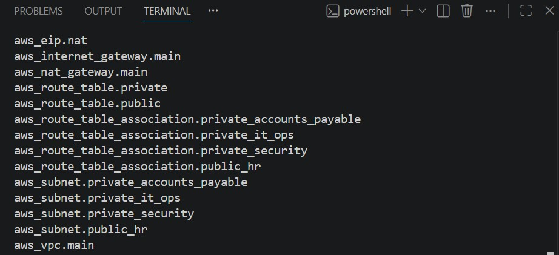

### AWS Budget

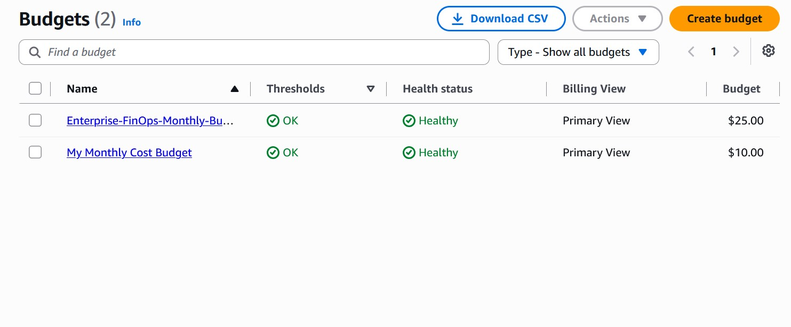

### Budget Details

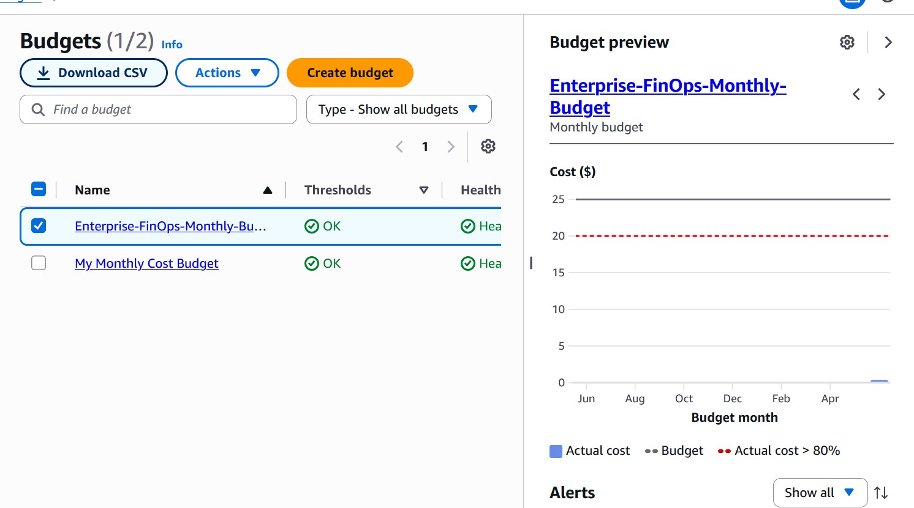

### AWS Cost Explorer

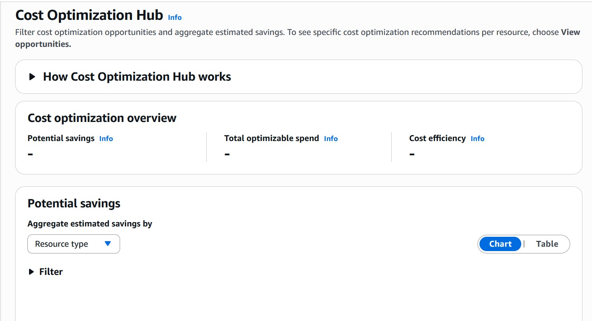

### AWS Cost Optimization Hub

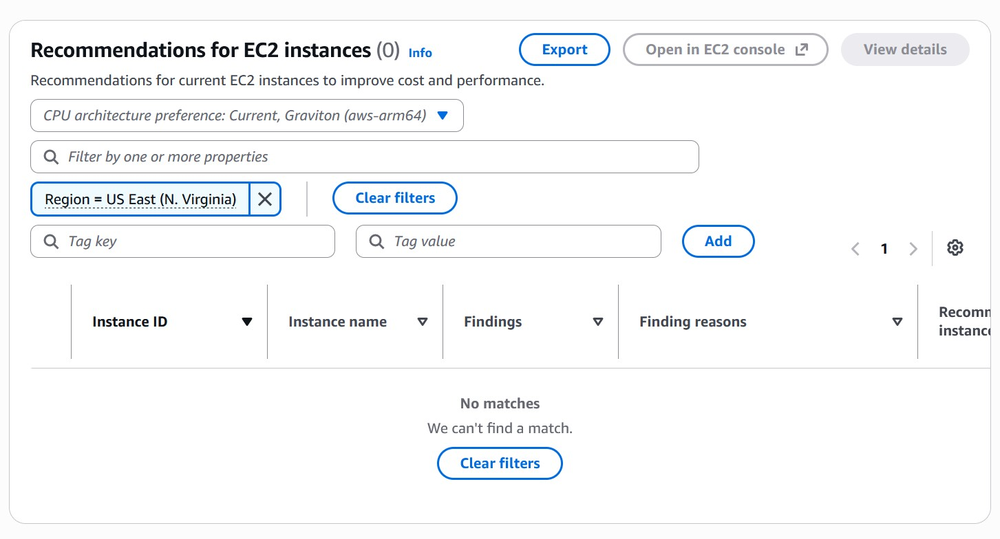

### EC2 Instance

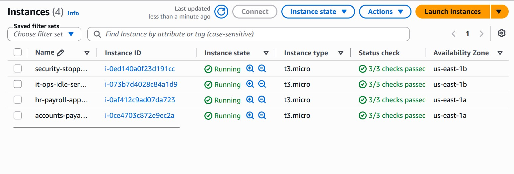

### Elastic IP

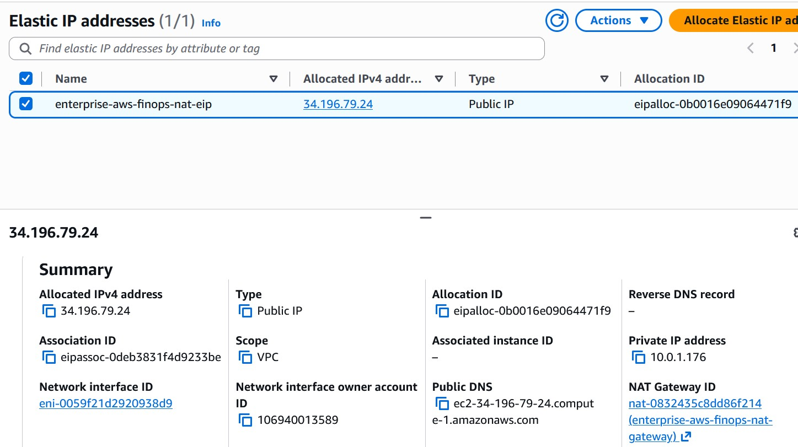

### Internet Gateway

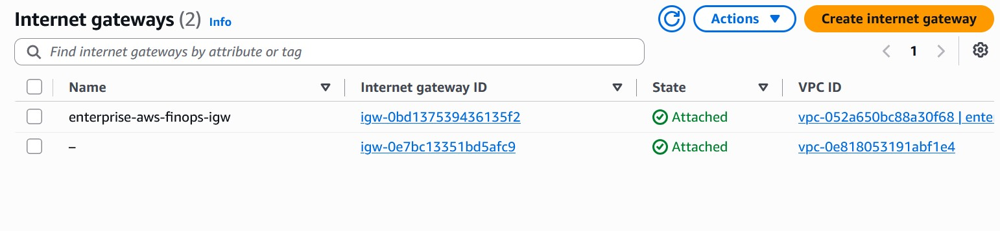

### Route Table

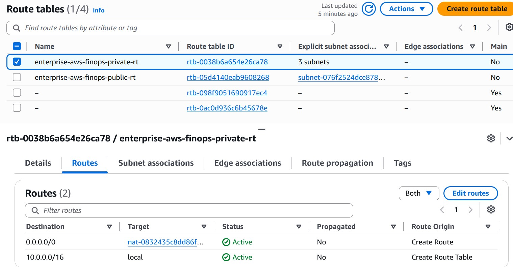

### Security Groups

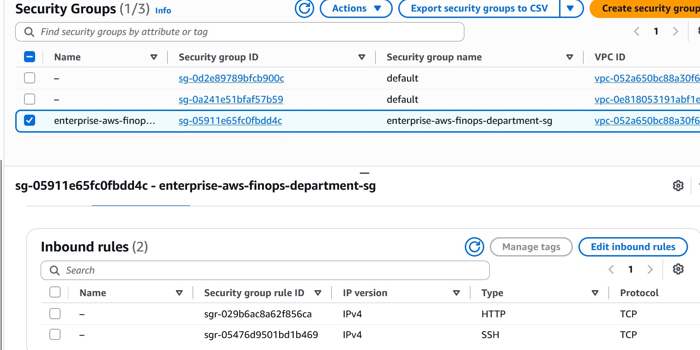

### Public Subnet

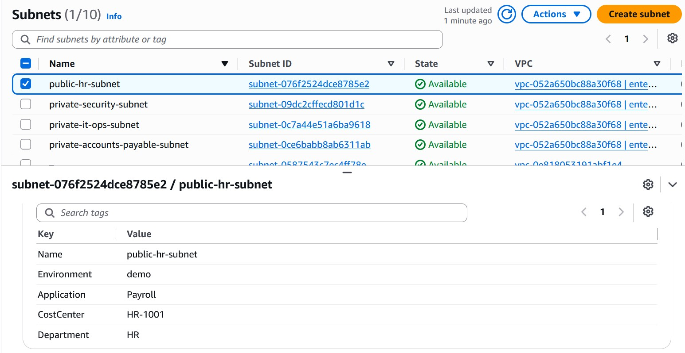

### Additional Subnet

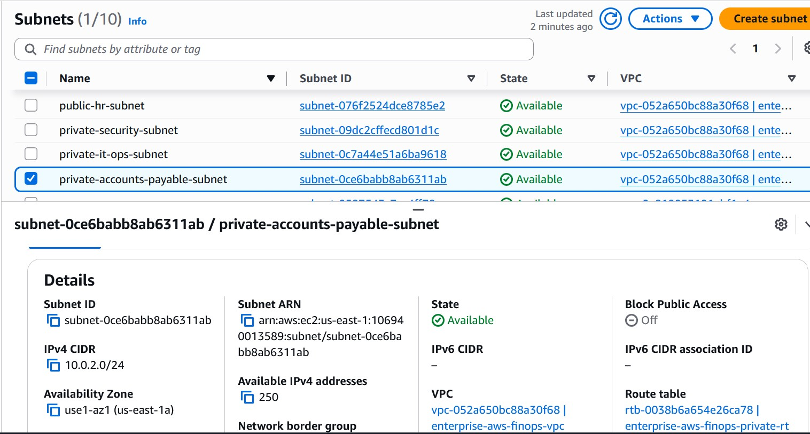

### Unused EBS Volumes


### Unused Elastic IP

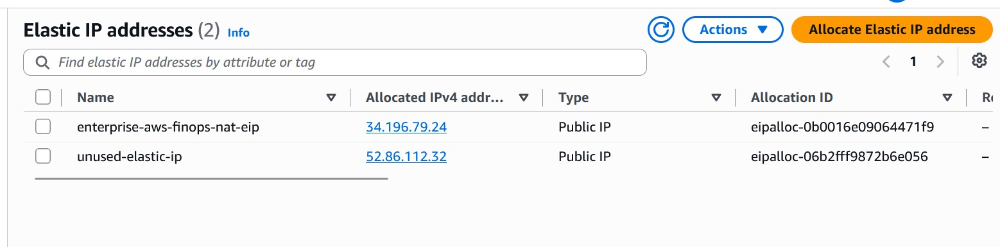

### Python Cost Report

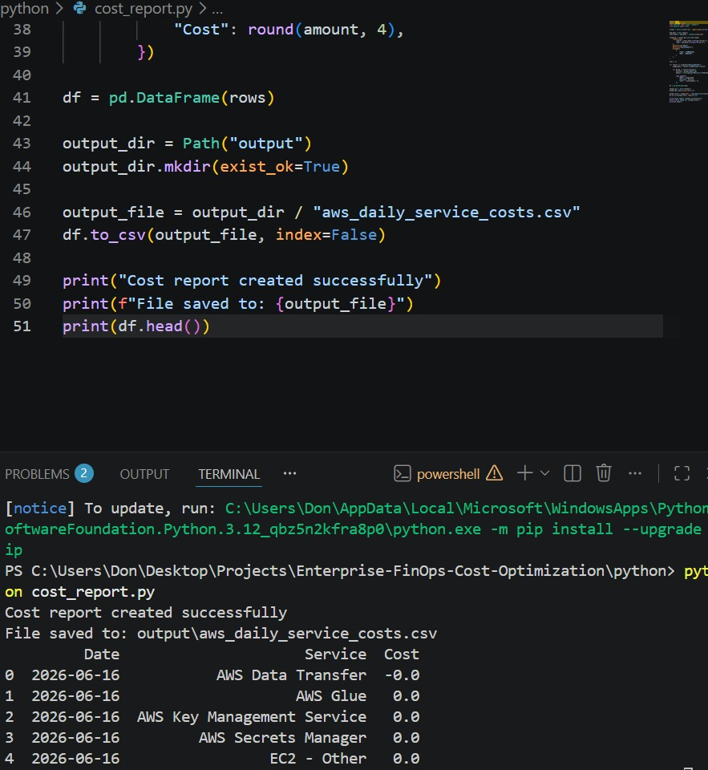

### Power BI Dashboard

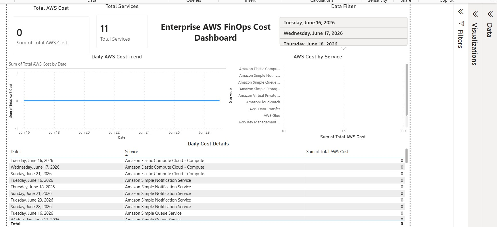

### Budget Alert (80%)

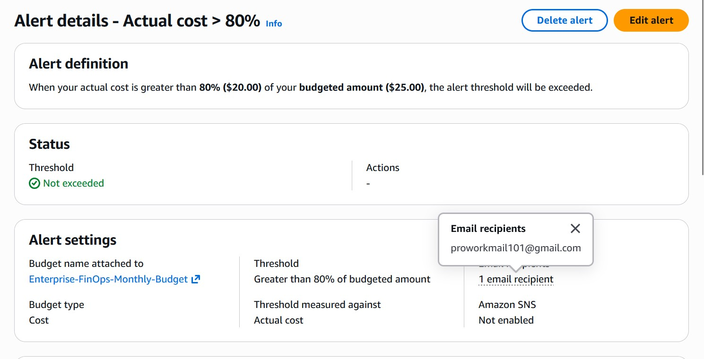

---

## Future Enhancements

- Amazon SNS Notifications
- AWS Lambda Automation
- EventBridge Scheduling
- Multi-Account Reporting
- Cost Anomaly Detection
- Executive Email Reporting

---

## Author

Promise Achinonu

Cloud Engineer | FinOps | AWS | Terraform | Python | Power BI
